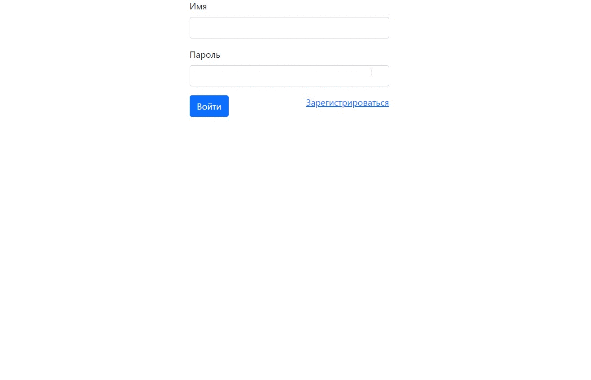
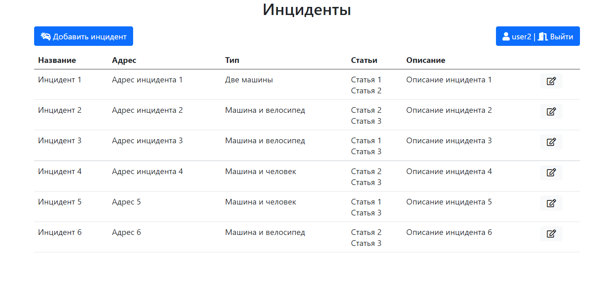
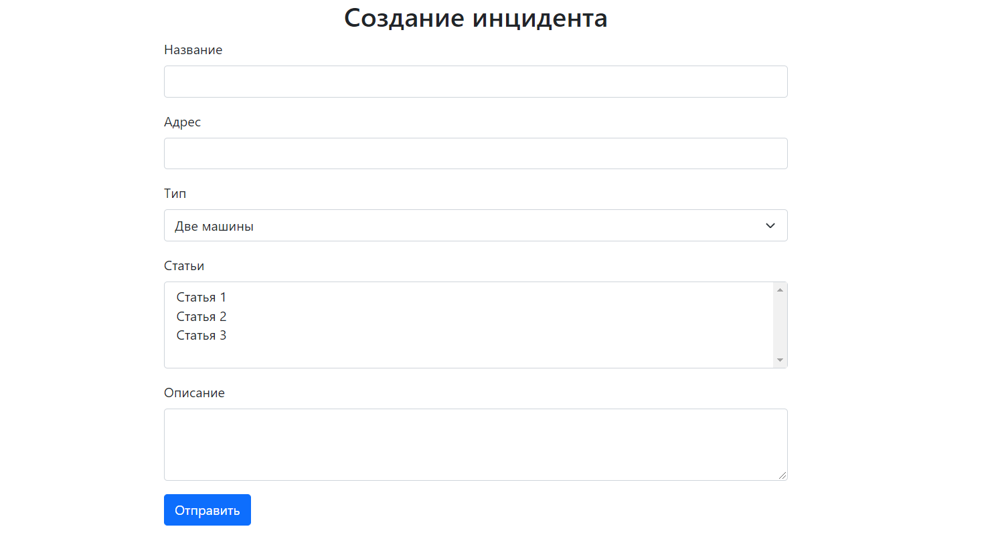
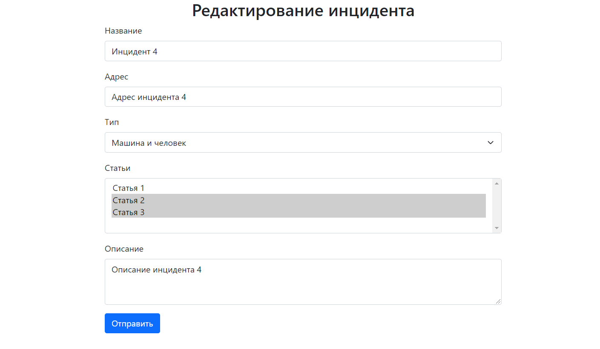

# Car Accident

### О проекте
Площадка для фиксации автомобильных правонарушений. Позволяет пользователям фиксировать ДТП. Правонарушения сохраняются в БД.

### Используемые технологии
- Spring (MVC, Data, Security)
- jsp, Bootstrap (front)
- PostgreSQL
- Java 14
- Apache Tomcat
- Maven

### Функционал
- Авторизация/регистрация.
- CRUD операции с использование PostgreSQL

### Демо

#### Общий вид

#### Создание инцидента

#### Редактирование инцидента

#### Вход

#### Регистрация
